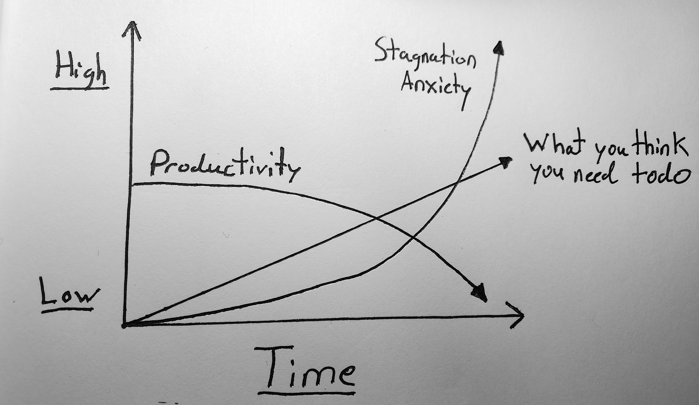
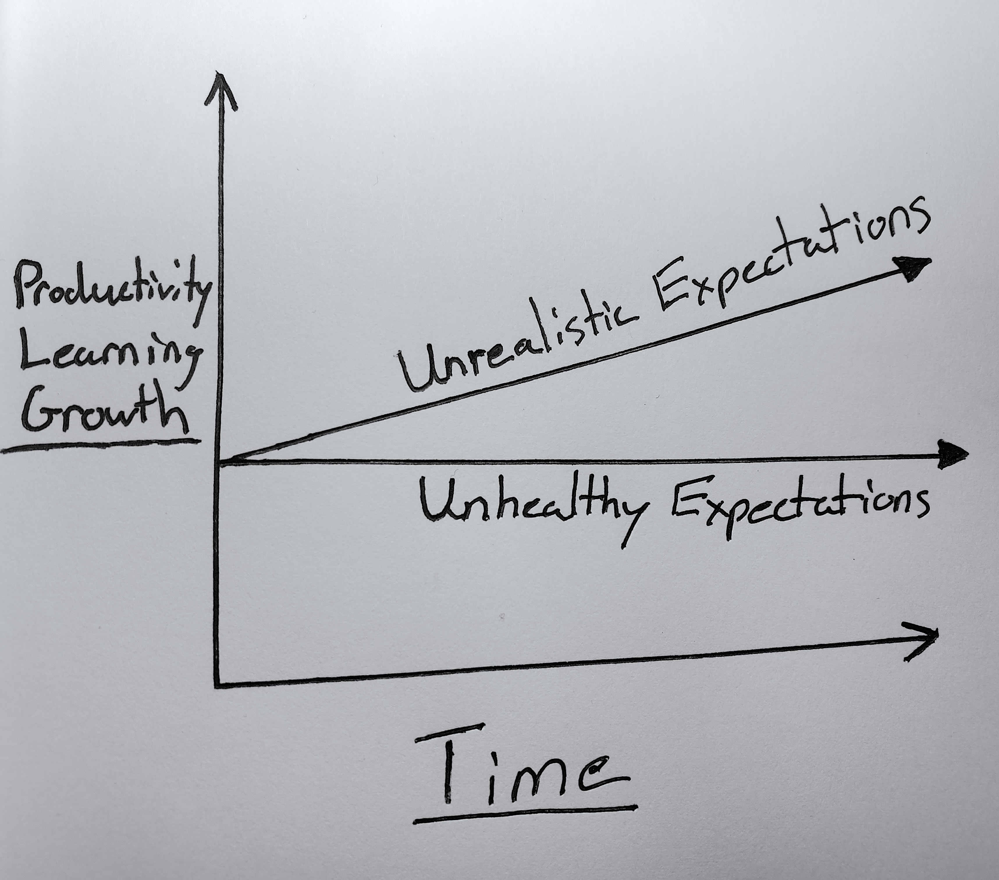
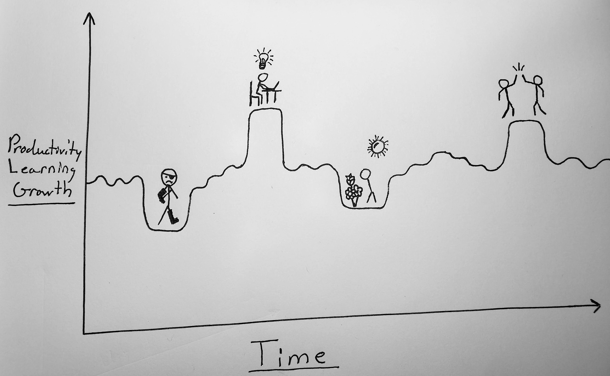

# First medium article!

Feeling like you have stagnated is easily one of the largest pitfalls when working with technology. It can feel like I am falling behind every day, even if I am frantically trying to digest everything. The overwhelming weight of what you should be learning piling up can hold anyone down. Conferences, papers, communities, influencers, articles, tutorials, packages, frameworks, YouTube videos, podcasts, and more are amassed daily on my todo list. I genuinely appreciate that we live in a world with so many passionate and curious individuals coming together to collaboratively help each other learn and make a lasting impact, for free nonetheless. However, at least for me, it started to weigh on me as a never-ending catching-up game. I hope my personal anecdote is helpful to those who may be feeling the same. 

## What Leads to Stagnation
Over the past year, I primarily took on a machine learning engineer role, supporting models with dev ops and cloud architecture. I was still involved in modeling decisions and problem-solving, but I wasn't in the weeds of the modeling as much as I was. After a tumultuous series of the tech industry shifting, personal events, family emergencies, and medical challenges, I got locked into autopilot mode. Each day, I just focused on what needed to be done and forgot to keep track of the direction in which I wanted to go.  

It becomes easy when there's an overwhelming pile of todos to let yourself add one more exciting thing you need to know. I started to justify reading a few papers and tutorials rather than committing to understanding and implementing something I wanted to learn. Eventually, unfinished proof of concepts became easier not to return to. Whether motivation or discipline is the primary factor for being productive, it's hard to do so when you've neglected both.

It's even more complicated when life seemingly gets in the way. Painful, complicated events can cause a lot of stress and anxiety in life that can affect your work. When stagnation mixed with anxiety, it became a consuming loop of self-doubt. It was easy for me to get stuck in choice paralysis while overthinking next steps and design decisions. In my mind, it was a way of trying to avoid dealing with problems in the future when, in retrospect, it felt like I was just avoiding the work I needed to get done. Eventually, the anxiety of making that decision would have eaten up more energy and time than just starting. Of course, there is a healthy balance between smart design decisions and acquiring tech debt, but at the end of the day, I was getting too much inside of my head. However, I think the feeling of stagnation is something I let creep in. 

<figure>
	
</figure>

## Stagnation is just a feeling
I find it funny that it is so easy to be hard on yourself. I've experienced burnout before, often from trying to do too much in too little time. I foolishly decided to overlap my undergrad with two minors (half of which was during a pandemic) and graduate degrees while working two jobs and trying to have a normal, social, healthy life. I burnt out. Since then, I've strongly supported the idea that life always comes above work, that a healthy balance with time for leisure is vital to purpose and energy, that productivity is a myth, and that hustle culture is toxic. 

Someone I regard as a mentor recently told me that feeling like you can struggle through a difficult time because it will be smoother on the other side is a straightforward way to bootstrap yourself into working hard forever. There's more life, and I can only speak for myself, but I often find it is our own childish ways of thinking and perspective that get in the way of appreciating what we have and knowing what we want despite how well we think we are trying. In the end, I feel like I let the same problem with a different name get a hold of me over the past year. 

Stagnation is just burnout without the grind, a crippling amount of fear of falling behind, preventing me from taking any steps forward. But that's why I'm writing this article, to remind myself, at the very least, that it is just a fear that is drawing my attention away from what is actually important; I have not stagnated. Family emergencies have made my family feel closer than ever, and medical problems started a health journey making me better about myself than ever. I was able to make and sustain healthier friendships. I gave myself the time and space to take risks and make mistakes outside of work. I can truly say that after much growth and wandering after graduation, I now know what I want out of life.

Also, that's not to say I let work entirely fall on the waist side. I still attempted to keep on top of new methods and technology. I just didn't feel like I was keeping up to my own standards and let it eat away at me for way too long. 

<figure>
	
</figure>

## Take a deep breathe
Returning to first principles and taking small steps is vital when you feel overwhelmed. Breaking down my giant list of todos down into manageable bites (after attending to life's todos) was a good first step. But really what I needed todo was to cut off a larege majority of it. You don't need to understand or do everything, because in the end you will never know or do everything. Knowing what you want is best paired with a bit of realism. 

And don't forget to breathe, eat well, sleep, and give yourself the space and time to make mistakes. These are not about being productive or solving your problems; they will probably help, but really, taking care of your health is just vital to living an enjoyable life. Also, don't forget to be humble, especially when you can afford the time to take care of yourself, as many others don't necessarily have the time and resources to.

One other thing that has vastly helped me is knowing what is and is not in my control. I never wanted to be a machine learning master, and I don't think anyone wants to be an expert in a whole domain of knowledge. However, I find machine learning especially interesting, so in retrospect, it makes sense my expectations naturally grew too high if I wasn't being realistic. Those expectations had to fall down at some point, and unfortunately, on the unlucky human that didn't know everything, me! I am only one human, awake for so many hours of the day and, unfortunately, not asleep enough hours of the night. 

Take breaks! No one can sustainably chunk off entire days or weeks to enter a hyper-focus cave and grind out expertise. There's more to life, even if it's your life passion. I do believe that from time to time, it's okay if you are enjoying the experience of learning and applying that knowledge, and it's okay to get lost in it for a while. However, I need to let myself do it because I want to and not out of some incessant and baseless need to catch up. It is essential to know that it is not the end of the world to focus on life or not sustain an unhealthy idea that you can always be productive.

After all this reflection, I think it's equally essential to remember that behind motivation and discipline is a sense of purpose. Knowing what you want to do is a sturdy foundation for moving forward through the feeling of stagnation. I want to get back to leaving yesterday in the past and taking each day head-on. I want to take on challenging problems with passionate people to create something I'm proud of at the end of the day. I want to explore what life has to offer with friends and help each other learn and tackle the world. So, I hope this first piece of writing helps you, but it's also helping me mark; no matter how clunky and awkward the writing is, it's okay. I have to start creating somewhere :^)

<figure>
	
</figure>

"Why Should I go further than I am able? Is it not enough for you that I am perfect?" -Spring and All by William Carlos Williams
