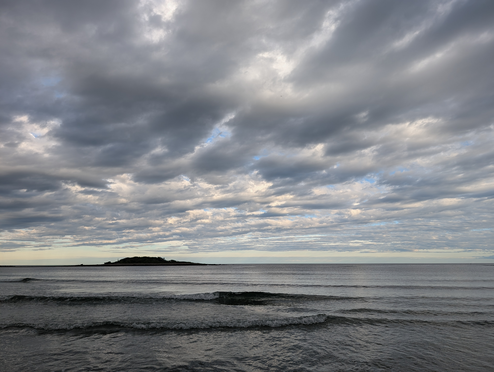

I'm back, and it feels better than ever. Getting very sick is always an eye-opener. The working theory is that some sort of virus got into the back of my eye, triggering an immune response that started attacking my eye. Most of my vision is getting better, and hopefully, I will make a full recovery over the year.

I took some time off from work to recover, and I am now taking some time off to enjoy a vacation with my family. I spent some time cleaning the cobwebs off of my Rust skills and implemented a terminal particle simulator, starting with steam coming off an ASCII art cup of coffee. I look forward to implementing OpenGL in Rust and returning to a normal routine. Life is so sweet and full of learning :^)

Sometimes its so worth it to stop, even if life makes you stop for a bit, and appreciate. "I loafe and invite my soul,
I lean and loafe at my ease observing a spear of summer grass." -- Walt Whitman, Song of Myself

<figure>
	
</figure>