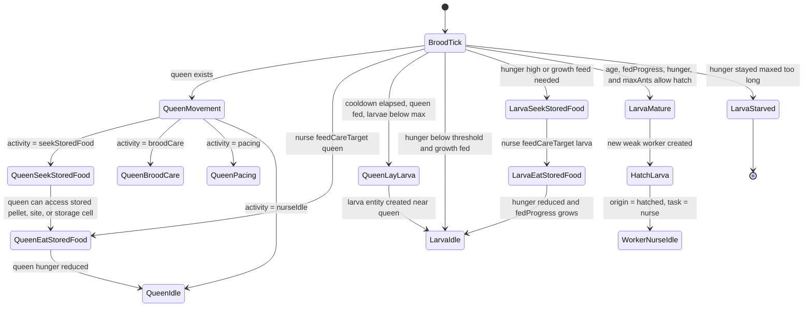
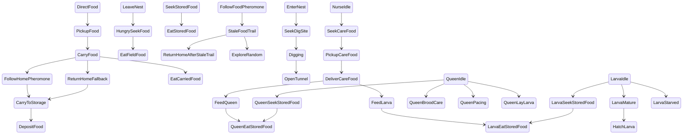
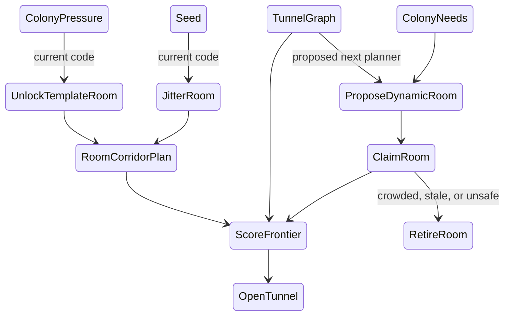
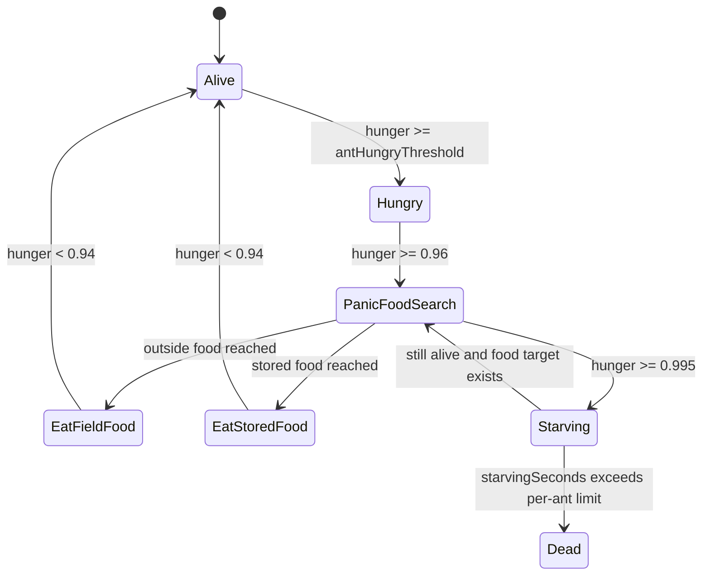
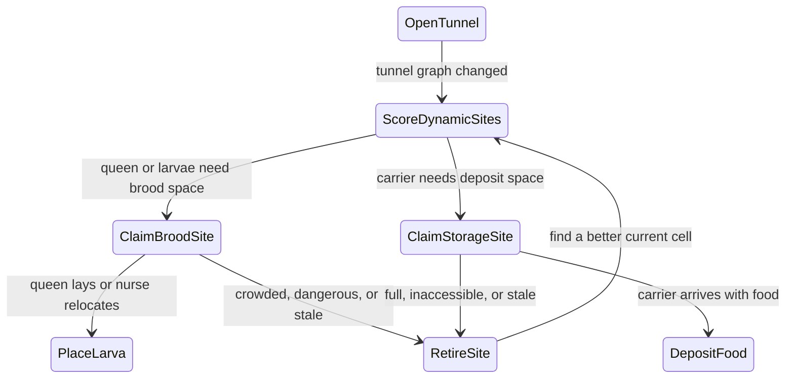
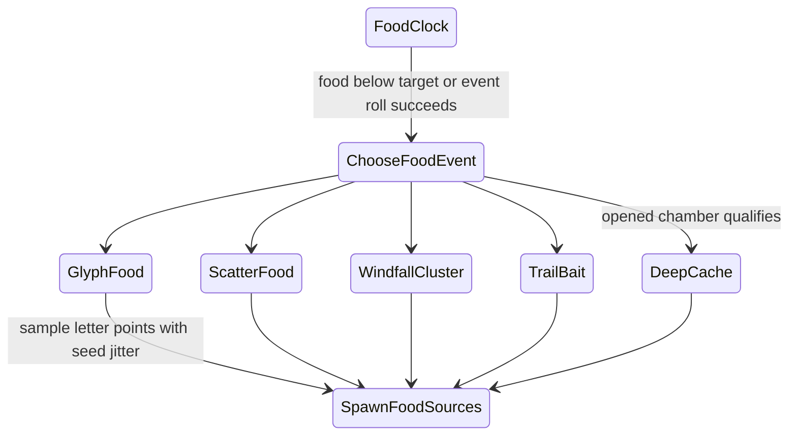
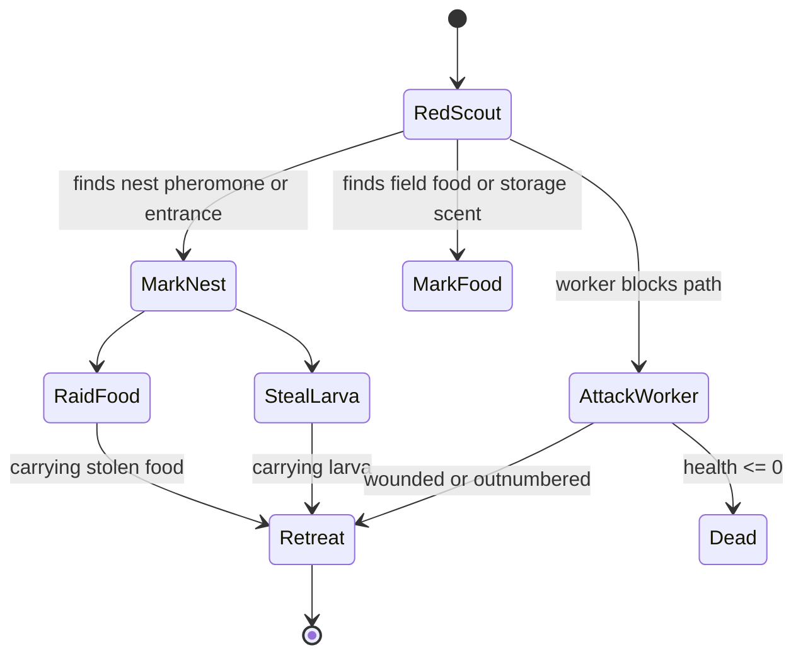

# Ant State Machine

This is the working model contract for debugging stuck ants. The renderer/debug UI should display model fields from `src/sim/AntModel.ts`; it should not infer behavior from colors or sprite choices.

## Runtime Fields

- Worker `task`: `forage`, `dig`, `nurse`.
- Worker `activity`: `idle`, `seekFood`, `carryFood`, `followFoodTrail`, `returnHome`, `enterNest`, `seekStoredFood`, `eatStoredFood`, `eatFieldFood`, `seekDigSite`, `digging`, `seekCareFood`, `deliverCareFood`, `feedQueen`, `feedLarva`, `nurseIdle`.
- Worker cargo flags: `carryingFood` is field-food cargo for storage; `carryingCareFood` is stored-food cargo for queen or larva delivery. Do not infer cargo from a blue/purple task halo alone.
- Worker origin fields: `origin`, `age`, and `hatchedFromLarvaId` distinguish seed ants from larvae-hatched ants.
- Queen `activity`: `nurseIdle`, `broodCare`, `seekStoredFood`, `pacing`.
- Queen `lastAction`: usually `seekStoredFood`, `queenEatStoredFood`, `queenLayLarva`, `nurseIdle`, or `spawn`.
- Larva `lastAction`: usually `seekStoredFood`, `larvaEatStoredFood`, `larvaMature`, `larvaStarved`, `nurseIdle`, or `spawn`.
- Renderer cue: blue halo means `task = dig`, purple halo means `task = nurse`, a food-colored pixel above the ant means `carryingFood`, and a pale yellow pixel above the ant means `carryingCareFood`.
- Outside food is a `Food` source with an `amount` that shrinks as ants take from it. Inside food is stored inventory made of `StoredFoodPellet` entities plus `StorageSite` counters. Stored food can be accessed from the pellet position, its storage site, or its tunnel destination cell.
- `recentEvents` is an append-only ring in each snapshot. Use event ids to de-duplicate sampled snapshots and count one-frame transitions like `depositFood`, `openTunnel`, `queenLayLarva`, `larvaMature`, and `larvaStarved`.
- Hungry field-food search expands with hunger: normal radius below `0.82`, wider at `0.82`, `starvingFoodSenseMultiplier` at `0.9`, and global search at `0.96`.
- Dig planning uses `DigRoom` ellipses plus corridor segments. Population, brood, stored-food, and tunnel pressure unlock expansion rooms, and a frontier cell must pass `digPlanScore <= MAX_DIG_PLAN_SCORE`.
- Current room topology is still template-driven: `digRooms()` has fixed storage/brood anchors plus a fixed expansion template array. The seed jitters room position/radius and runtime behavior, but it does not yet generate wholly new macro colony layouts.

## Worker Loop

Runtime worker loop, matching `updateAnt()` priority order:

```mermaid
stateDiagram-v2
  [*] --> WorkerTick

  WorkerTick --> CarryFood: carryingFood
  WorkerTick --> CareCargo: carryingCareFood
  WorkerTick --> Hungry: hunger >= antHungryThreshold and no cargo
  WorkerTick --> Dig: task = dig
  WorkerTick --> Nurse: task = nurse
  WorkerTick --> Forage: fallback task = forage

  CarryFood --> ReturnHome: outside nest
  ReturnHome --> CarryToStorage: reaches open nest tunnel
  CarryToStorage --> RetargetStorage: carryingSeconds > 34
  RetargetStorage --> CarryToStorage: stale target cleared
  ReturnHome --> EatCarriedFood: hungry and carrying too long
  CarryToStorage --> EatCarriedFood: hungry and carrying too long
  CarryToStorage --> EmergencyDeposit: inside tunnel and carryingSeconds > 41.5
  ReturnHome --> EmergencyDeposit: stale carrier reaches nest mouth
  EmergencyDeposit --> DepositFood: current tunnel or entrance cache
  EatCarriedFood --> WorkerTick: hunger reduced, no storage added
  CarryToStorage --> DepositFood: reaches storage destination
  DepositFood --> WorkerTick: stored-food pellet created

  CareCargo --> EnterNest: not in open tunnel
  EnterNest --> CareCargo: reaches open tunnel with care cargo
  CareCargo --> DeliverCareFood: valid queen or larva target
  CareCargo --> NurseIdle: care target disappeared
  DeliverCareFood --> FeedQueen: reaches queen
  DeliverCareFood --> FeedLarva: reaches larva
  FeedQueen --> WorkerTick: queen hunger reduced
  FeedLarva --> WorkerTick: larva hunger reduced and fedProgress grows

  Hungry --> EatFieldFood: outside and food within hunger-scaled search radius
  EatFieldFood --> WorkerTick: field food consumed, hunger reduced
  Hungry --> ReturnHome: stored food exists and ant is outside
  ReturnHome --> SeekStoredFood: reaches open nest tunnel
  Hungry --> SeekStoredFood: stored food exists and ant is inside
  SeekStoredFood --> EatStoredFood: can access pellet, site, or storage cell
  EatStoredFood --> WorkerTick: stored pellet consumed, hunger reduced
  Hungry --> LeaveNest: no stored food and ant is inside
  LeaveNest --> HungrySeekFood: reaches nest entrance
  Hungry --> HungrySeekFood: no stored food and ant is outside
  HungrySeekFood --> EatFieldFood: finds outside food

  Dig --> EnterNest: assigned while outside or on closed soil
  EnterNest --> SeekDigSite: reaches open nest tunnel
  Dig --> SeekDigSite: open tunnel and planned frontier exists
  SeekDigSite --> Digging: near tunnel neighbor of target
  Digging --> OpenTunnel: digProgress >= 1
  OpenTunnel --> SeekDigSite: next frontier target
  Dig --> Explore: no allowed planned frontier cells

  Nurse --> EnterNest: assigned while outside or on closed soil
  EnterNest --> Nurse: reaches open nest tunnel without cargo
  Nurse --> NurseIdle: no queen or larva needs food
  Nurse --> SeekCareFood: care target exists and no cargo
  SeekCareFood --> PickupCareFood: can access pellet, site, or storage cell
  PickupCareFood --> DeliverCareFood: carryingCareFood true

  Forage --> LeaveNest: inside nest without cargo
  LeaveNest --> Forage: reaches nest entrance
  Forage --> DirectFood: food within foodSenseRadius
  DirectFood --> CarryFood: reaches food and amount > 0
  DirectFood --> Explore: food exhausted before pickup
  Forage --> FollowFoodTrail: food pheromone found
  FollowFoodTrail --> DirectFood: food becomes visible
  FollowFoodTrail --> StaleTrail: trail end has no food
  StaleTrail --> FollowFoodTrail: alternate trail found
  StaleTrail --> ReturnHome: far from nest
  StaleTrail --> Explore: near nest or no alternate trail
  Forage --> Explore: no food, no useful trail

  Explore --> AvoidBoundary: near or outside bounds
  FollowFoodTrail --> AvoidBoundary: near or outside bounds
  HungrySeekFood --> AvoidBoundary: near or outside bounds
  ReturnHome --> AvoidBoundary: hits world edge
  AvoidBoundary --> HungrySeekFood: hungry surface ant targets nearest food
  AvoidBoundary --> ReturnHome: carrying or underground recovery
  AvoidBoundary --> Explore: free surface worker recenters
```

## Queen And Brood Loop

Queen and brood loop, matching `updateQueen()`, `updateQueenMovement()`, `updateLarvae()`, and nurse delivery:

## Flat Action Names

Flat action names for grep-friendly debugging. These are `lastAction` style labels, plus queen activity labels where useful:

## Stuck Cases

| Symptom | Likely state problem | Current fix or next fix |
| --- | --- | --- |
| Carrier wanders with food | `ReturnHome` or storage targeting can hold stale destinations | Carriers now clear stale storage targets after `34s`, steer directly home after `38s`, emergency-deposit in a tunnel or at the nest mouth after `41.5s`, and may eat carried food if starving |
| Ant orbits old food spot | `FollowFoodTrail` had no stale-trail invalidation | Strong trail with no local food now weakens nearby food pheromone |
| Ant sits in corner | Edge reflection can keep it near bounds | `AvoidBoundary` now chooses food for starving surface ants, field center for free surface ants, and nest entrance for underground recovery |
| Ant looks blue or marked at spawn | Visual role color can be mistaken for cargo | Blue is dig task, purple is nurse task; cargo truth is only `carryingFood` or `carryingCareFood` |
| Digger looks like it is carrying | Task label and visual role can conflict with carrier override | Carrying ants now force `task = forage`; renderer keeps carrying color separate |
| Stored food looks disconnected | Deposit happened at nest entrance and storage was only a drawn counter | Carriers now continue to `STORAGE_CELL` and deposit stored-food pellet entities |
| Queen walks to storage but does not eat | Queen can target storage but must satisfy stored-food access distance | Queen now directly eats when she can access the pellet/site/cell; nurses can also feed her |
| Ant seems near storage but cannot eat | Stored pellets may be offset from their site or destination cell | `canAccessStoredFood` accepts the pellet position, storage site, or tunnel destination cell |
| Starving ant ignores distant food | Food sensing used one fixed radius | Hunger now expands field-food search, reaching global search at hunger `0.96` |
| Care worker gets hungry while delivering | `carryingCareFood` has priority above hunger | Intentional for now; care cargo must be delivered or dropped before hunger can override |
| Care target disappears while food is carried | Larva can hatch or starve before delivery | Current loop drops care cargo and returns to `NurseIdle`; possible next fix is returning it to storage |
| Outside digger scrapes along surface | `Dig` steered directly to an underground work site | Outside diggers now run `EnterNest` before `SeekDigSite` |
| Long-run nest becomes one surface blob | Expanding radial dig band reached the entry/storage collar | Digging now uses room ellipses, corridor scores, an entry collar, and pressure-unlocked expansion rooms |
| Hungry ants ignore food | Hunger was not modeled separately from task | Non-carriers now route to stored food, eat nearby field food, or forage if storage is empty |
| Digging looks random | Frontier selection had too much local randomness | Dig targets now follow `DigRoom` room ellipses and corridor segments with crowd penalties; macro room layout is still a template plus seed jitter |
| Nursing does little | Nurse allocation rounded too low when brood pressure rose | Nurse count now reserves at least one nurse, scales with larvae, and accounts for queen hunger |
| Queen/larvae eat magically | It is unclear whether food was eaten directly or nurse-delivered | Queen direct eating is explicit as `queenEatStoredFood`; larvae are nurse-fed only |
| Larvae never become ants | Larvae had age/hunger but no growth threshold | Larvae now need age plus fedProgress to hatch into weak new ants |

## Invariants To Keep

- Worker priority is `carryingFood`, then `carryingCareFood`, then hunger, then `dig`, then `nurse`, then forage fallback.
- A carrying ant normally runs `CarryFood -> ReturnHome -> CarryToStorage -> DepositFood` before any non-forage task.
- A carrying ant that has held food longer than `34s` may retarget to a nearby accessible cache site; after `38s` it stops trusting home-pheromone loops and steers directly home.
- A carrying ant that reaches `41.5s` inside a tunnel or at the stale-carrier nest mouth may make a small cache deposit at that tunnel/entrance cell.
- A hungry carrier at hunger `>= 0.92` after `35s` may eat its carried food instead of dragging it forever.
- A care-carrying ant stays in the nurse loop until it feeds the queen/larva or its target disappears.
- A hungry non-carrying ant may override its assigned task to eat stored food or field food.
- Nearby outside food beats stored food for a hungry ant that is already outside.
- Outside food search radius scales with hunger, up to global search at hunger `0.96`.
- Stored-food pellets are edible inventory; eating one decrements the pellet, storage site count, and global `storedFood` count.
- Stored-food access can resolve through the pellet position, the owning `StorageSite`, or the pellet's tunnel destination cell.
- The queen may directly consume an accessible stored-food pellet when hungry; nurses can also deliver care food to her.
- Larvae do not consume storage directly; nurses move stored pellets to larvae.
- The queen is a slow nest-bound ant: she moves only through open tunnels, paces when idle, drifts toward brood, and approaches storage when hungry.
- The queen lays larvae only when fed enough and the lay cooldown has elapsed.
- A larva hatches only after enough age, enough nurse feedings, tolerable hunger, and available ant capacity.
- Hatched ants start weak, with `origin = hatched`, `task = nurse`, and `lastAction = hatchLarva`.
- Debug snapshots label ants with `origin`, `age`, and `hatchedFromLarvaId`; hatched ants should not be inferred from id ranges.
- A digger assigned outside must enter through the nest tunnel before seeking an underground work site.
- An inside ant leaving the nest should route toward `nestExitDestination()` while it is still in open tunnel space.
- A digger can only open an inside soil cell adjacent to an existing tunnel.
- A dig target must be allowed soil, pass `digPlanScore <= MAX_DIG_PLAN_SCORE`, and belong to the planned room/corridor layout.
- Seeds currently jitter planned rooms and runtime choices; they do not prove that room placement is emergent. If rooms should feel unplanned, replace or augment the template array with dynamic room candidates from the opened tunnel graph.
- New dig targets must stay below the protected entry collar, avoid over-crowded tunnel patches, and avoid turning the entrance into a surface chamber.
- Storage sites should prefer storage/expansion-room affinity, prefer chamber-like cells, avoid brood/queen rooms, and give narrow corridors lower capacity.
- Boundary recovery should steer hungry surface ants toward the nearest field food, underground ants toward the nest entrance, and free surface ants back toward the field center.
- Food pheromone means "food was found along this path"; if no food remains, the endpoint must decay faster.
- Live ants and the queen must stay within open movement space; closed soil collision should redirect, not trap.
- Task allocation changes assignment, not physics.

## Design Exploration: Death, Sites, Food, And Threats

Some of these are implemented contracts, and some are proposed next contracts. The design goal is still dynamic colony behavior rather than fixed scenery.

## Battle-Test Results

Latest retest after `recentEvents`, tunnel-safe stored-food placement, and carrier stuck fallbacks:

- Production build: `pnpm build`.
- Normal audit: `pnpm run audit`, seeds `1-4`, 720 simulated seconds each, default speed, sampled once per second.
- Fast dig quick audit: seeds `1-4`, 600 simulated seconds each, `digRatePerSecond * 1000`, sampled every `30s`.

Summary:

| Test | Result | What it means |
| --- | --- | --- |
| Normal 720s seeds 1-4 | All four seeds reached `24` ants | Brood loop is currently reliable across this small seed set |
| Normal 720s seeds 1-4 | Final larvae ranged `4-7`; max sampled larva starvation was `0s` | Nursing is no longer flirting with the larva starvation edge in this run |
| Normal 720s seeds 1-4 | Worker max hunger hit `1.0` in seeds `1`, `2`, `3`, and `4` | Hunger panic recovers often, but worker death would expose economy variance |
| Normal 720s seeds 1-4 | Longest sampled carrier trip was `42.60s`; long-carrier samples were `0` | Stale carrier fallback now prevents visible food-hoarding loops in this seed set |
| Normal 720s seeds 1-4 | Final stored food ranged `7-55`; storage sites ranged `3-13` | Storage creation is dynamic and food clusters, but site proliferation needs visual audit |
| Normal 720s seeds 1-4 | Bad stored-food pellet samples were `0`; final bad stored pellets were `0` | Stored-food entities now stay in open tunnel cells instead of being offset into soil |
| Normal 720s seeds 1-4 | Event counts captured `depositFood`, `openTunnel`, `queenLayLarva`, `larvaMature`, and `hatchLarva` | `recentEvents` fixes the one-frame action blind spot |
| Fast dig seeds 1-4 | Reached `2434-2678` tunnels and `2379-2623` newly dug cells | Current expansion templates no longer hit the old `703`-tunnel ceiling |
| Fast dig seeds 1-4 | Final frontier stayed high at `835-875`; idle-digger samples were only `1-2` of `20` | Diggers mostly keep working, but the plan is broad and still template-driven |
| Fast dig seeds 1-4 | Final active dig cells were `0` | With `digScale = 1000`, cells open almost instantly, so this is not by itself a stall signal |

Problems found:

- Worker hunger reaches max but has no death or lasting injury. Add death timers only after giving panic behavior enough readable warning.
- Carrier trips no longer cross the `45s` stuck threshold in the latest normal audit. Watch whether emergency cache deposits make storage sites feel too scattered in long visual runs.
- Diggers no longer run out of plan quickly, but the macro plan is still authored as a room template array. That is why seeds matter for jitter and behavior, not for proving fully emergent colony architecture.
- `recentEvents` now captures one-frame actions, including `larvaStarved` before a larva is removed. Audit scripts should use event ids rather than `lastAction` sampling.
- Food economy variance is large. Before worker death ships, tune food spawn/vision so low-food seeds are recoverable without feeling arbitrary.
- Storage sites are now dynamic but still biased by planned room kinds. If the visual goal is more organic, storage and brood sites should be claimed from the opened tunnel graph, not only from `DigRoomKind` affinity.

Current fix pass:

- Dynamic dig expansion now unlocks from population, larvae, stored-food, and `tunnelsDug` pressure instead of stopping at the same three planned rooms.
- Expansion rooms are seed-jittered and corridor-linked to the closest earlier room, so long runs should branch from the existing nest instead of converging on one identical layout.
- Storage-site scoring now prefers storage/expansion rooms, penalizes brood/queen rooms, fills non-full existing sites first, and gives corridors smaller capacity.
- Carriers now clear stale storage targets, ignore looping pheromones when stale, emergency-cache at the tunnel/entrance, and eat carried food when starving.
- Stored-food pellet coordinates now snap safely inside open tunnel cells, so snapshot rounding cannot push food into adjacent soil.
- `recentEvents` now records exact transition events in snapshots, and `pnpm run audit` de-duplicates them by id.
- Fast-forward analysis SVGs must stay visually aligned with the live renderer; the queen pixel-sprite mismatch was fixed in `scripts/fast-forward-digging.mjs`.

Next fixes, in order:

1. Add clearer brood-room scoring so larvae gather in readable nursery pockets as the queen moves.
2. Audit whether emergency cache deposits create too many tiny storage sites, then merge nearby/low-count sites if needed.
3. Add worker starvation timers and death reasons, but only after the food economy is less seed-swingy.
4. Add `FoodEvent` spawns, starting with scatter/windfall, then the playful seeded `B` glyph.
5. Add red ant scouts as rare pressure events once death/event logs exist.

### Seed Scope And Room Planning

Seeds are still useful, but the current room plan is not truly generated from scratch. Today, seeds influence outside food placement, ant behavior, pheromone decisions, room jitter, and the timing pressure that unlocks template rooms. They do not decide the broad sequence of chambers.

That means multi-seed tests are good for finding stuck ants, food variance, starvation risk, carrier loops, and jittered-room edge cases. They are not proof that the colony layout feels discovered. For that, the next dig planner should create candidate rooms from the tunnel graph and colony needs, then let workers claim, retire, or expand those rooms over time.

### Hunger Death

Current worker math: `antHungerRatePerSecond = 0.0045`. A seed worker starts around hunger `0.18-0.56`, becomes hungry at `0.72`, reaches global outside-food search at `0.96`, and reaches max hunger roughly `98-182s` after spawn if never fed. From the hungry threshold, max hunger is about `62s` away. Workers currently do not die; energy only bottoms out at `0.2`.

Good first pass:

- Add worker fields `starvingSeconds` and `deadReason`.
- Start `starvingSeconds` when hunger is `>= 0.995`; reset it when hunger drops below `0.94`.
- Kill a worker after `45-75s` at max hunger, with a seeded per-ant variance so the colony does not collapse all at once.
- At hunger `>= 0.96`, let the ant abandon normal task priority after cargo rules: drop care cargo if no target, stop digging/nursing, and panic-search food.
- Keep larvae harsher than workers but not instant: the current larva rule is hunger `>= 0.98` for `34s`, which means a never-fed larva dies roughly `167-225s` after birth depending on starting hunger. If nursing is still path-fragile, tune this to `45-60s` before removing the larva.
- Queen death should be slower and dramatic: start a queen starvation timer at hunger `>= 0.995`, and end the colony after `180-240s` unless she eats. The queen should not die before the player can read what is happening.

### Dynamic Brood And Food Sites

The current dig planner has planned rooms and corridors, but brood and storage should not feel hand-placed. Treat rooms as affordances, not hard scenery. The colony should discover soft sites from the tunnels it has actually opened.

Brood placement proposal:

- Keep `layLarva()` near the queen for the first moment, but let nurses relocate larvae once `BroodSite` scoring exists.
- A good brood site is open tunnel, inside, close to queen or existing larvae, away from the entrance, away from high-traffic storage, and inside a chamber-like patch with several nearby tunnel cells.
- Create brood sites lazily: when the queen lays or a nurse carries larvae, score nearby open cells and claim the best cell as a temporary brood site.
- Let brood sites expire or migrate if the room becomes crowded, dangerous, or too close to food storage.

Food storage proposal:

- Keep `StorageSite` dynamic; carriers should create new sites from the current tunnel graph rather than using fixed zones.
- A good storage site is reachable, chamber-like, not too close to the entrance, not overlapping brood, and has enough neighboring tunnel cells for capacity.
- If a site fills, carriers score another open tunnel cell and create a new storage site. This makes food piles emerge from digging instead of appearing pre-authored.
- If a later chamber becomes better, storage can naturally spread by future deposits; do not teleport existing stored pellets.

### New Food Events

Current food is seeded at startup with `createFood()` and respawns randomly while `food.length < initialFoodCount`. That is fine as a baseline, but the next layer should be explicit `FoodEvent`s so food arrival has personality.

Food event ideas:

- `scatter`: normal random crumbs, seeds, and leaves on the surface.
- `windfall`: a cluster falls from one side and leaves a stronger food pheromone opportunity.
- `trailBait`: tiny crumbs appear in a loose line, teaching pheromone trails.
- `glyph`: sample a text glyph into several food piles. For your last name, use the first letter `B` from `Brusberg` as an occasional seeded food spill. Jitter, rotate, and partially drop points so it reads as a playful spill, not fixed map art.
- `deepCache`: rare food appears just inside an opened chamber after digging exposes it.

### Red Ant Threats

Red ants should be another dynamic event, not a constant punishment. They can make food and larvae matter without turning the sim into pure combat.

Good first pass:

- Add `RedAnt` entities with `scout`, `raidFood`, `attackWorker`, `stealLarva`, `retreat`, and `dead` states.
- Spawn scouts from a surface edge after stored food or larvae become attractive enough.
- Scouts flee if outnumbered; raids happen only after a scout has found food, larvae, or the nest entrance.
- Workers should first avoid, then defend if red ants reach brood or storage.
- Red ants can kill workers by combat, while hunger kills by starvation timers. Keep those reasons separate for debugging.

